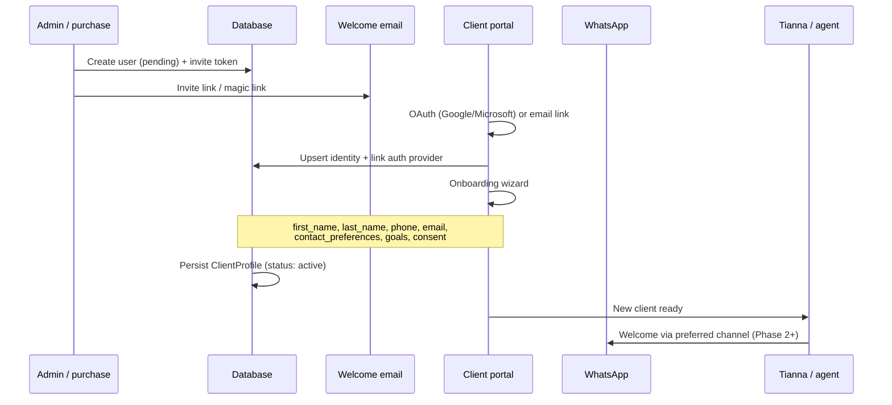
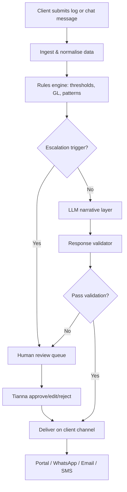
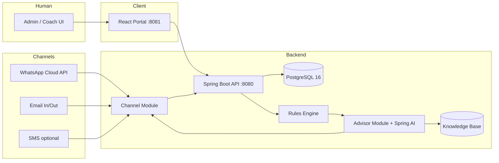

# Thrive with Tianna — Client Portal & Agentic Coach Specification

**Status:** Draft for review  
**Last updated:** June 2026  
**Owner:** Thrive with Tianna  
**Related:**

| Document | Role |
|----------|------|
| [`PLATFORM_SPEC.md`](./PLATFORM_SPEC.md) | Business scope, phasing, exclusions |
| [`CLIENT_PORTAL_BUSINESS.md`](./CLIENT_PORTAL_BUSINESS.md) | Operating model: personas, journeys, coach playbook, agent voice |
| [`COMPETITIVE_ANALYSIS.md`](./COMPETITIVE_ANALYSIS.md) | Competitors, demographics, positioning, messaging |

---

## 1. Executive Summary

The **Client Portal** is a secure web application linked from the marketing site (`index.html` → Client Hub / Client Login). Paying clients use it to log weight, meals (with portions and weights), sleep, and wellbeing symptoms. The system analyses this data against each client’s stated goals and returns **supportive, evidence-informed guidance** aligned with Thrive’s low glycemic load (low-GL) methodology.

**Delivery strategy:**

| Stage | Coach experience | Human role |
|-------|------------------|------------|
| **Phase 1 — Founder-led** | Structured feedback and messages authored or approved by Tianna | Tianna reviews inputs and sends guidance (portal may queue drafts) |
| **Phase 2 — Agentic assist** | AI coach generates responses from rules + client data | Tianna validates rule set; optional review queue for flagged responses |
| **Phase 3 — Personal agent** | Each client has a persistent “Thrive Coach” chat persona | Tianna audits samples, updates knowledge base, handles escalations |

The portal is the **system of record** for client identity, goals, and health logs. The **agentic coach** reaches clients on their preferred channels — portal chat, **WhatsApp (individual, via registered phone number)**, **email**, and optionally **SMS** — and can also message **group cohorts** via configured group email addresses or group phone/WhatsApp numbers.

The portal **complements** live coaching sessions and WhatsApp peer community; the agent extends 1:1 support between sessions. It is **coaching support**, not medical diagnosis or treatment.

---

## 2. Goals & Success Criteria

### 2.1 Product goals

1. Give clients a single place to track nutrition, weight, sleep, and symptoms between sessions.
2. Translate logs into **actionable, low-GL guidance** tied to their personal targets.
3. Reduce friction for Tianna by surfacing patterns before 1:1 and group sessions.
4. Build toward a **scalable agentic coach** that feels personal but stays within validated nutritional boundaries.

### 2.2 Success metrics (12-month horizon)

| Metric | Target (indicative) |
|--------|---------------------|
| Weekly active loggers | ≥ 70% of active clients log ≥ 4 days/week |
| Time-to-first-log after onboarding | < 24 hours |
| Coach response latency (Phase 1) | < 48 hours for non-urgent feedback |
| Agent response latency (Phase 2+) | < 30 seconds for in-chat guidance |
| Client-reported “felt supported” (survey) | ≥ 4/5 |
| Escalation rate (symptoms → human review) | Track; no fixed target initially |

---

## 3. Scope

### 3.1 In scope

- **Identity & database:** persistent user records with first name, last name, phone, email, contact preferences, and goals
- **Authentication:** OAuth (Google, Microsoft) plus email magic link; link social identity to user record
- **Admin user lifecycle:** onboard (invite, activate, assign programme), offboard (suspend, revoke access, archive)
- **Client onboarding wizard:** goals, baseline metrics, dietary preferences, consent — all persisted to database
- Daily / per-meal logging with quantities
- Weight, sleep, energy, mood, and symptom logging
- Dashboard: trends, GL projection, adherence, streaks
- Coach chat interface in portal (async Phase 1 → real-time Phase 2+)
- **Multi-channel agent:** individual WhatsApp (E.164 phone), email, optional SMS; group broadcast to cohort email/phone
- Rules engine + knowledge base for low-GL guidance
- Agentic workflow with founder validation layer
- Coach admin: roster, client detail, review queue, rule management
- Integration hooks: link from marketing site, post-purchase account provisioning

### 3.2 Out of scope (per platform spec)

- Food ordering, meal delivery, cooking fulfilment
- Clinical diagnosis, prescribing, or replacing GP/dietitian care
- In-platform video sessions (external link e.g. Zoom is fine)
- Public peer-to-peer social feed inside the portal (WhatsApp groups remain the peer community layer)
- Unsolicited outbound messaging to numbers/emails not registered in the system
- Children’s programmes

### 3.3 Assumptions

- Clients are adults (18+) who have purchased a coaching programme or menu plan bundle including portal access.
- Primary nutrition framework is **low-GL** (glycemic load), consistent with site positioning.
- UK GDPR applies; health-related data requires explicit consent and clear retention policy.

---

## 4. User Roles & Permissions

| Role | Access |
|------|--------|
| **Client** | Own profile, logs, dashboard, chat with coach/agent, view assigned menu plans |
| **Coach (Tianna)** | All clients in roster; edit goals/plans; review queue; approve/edit agent replies; manage rules (Phase 2+) |
| **Admin** | Full user lifecycle (onboard/offboard), role assignment, billing flags, compliance exports, channel config, system settings |
| **System (agent)** | Send/receive messages on permitted channels; no direct DB admin access |

**RBAC rule:** Clients never see other clients’ data. Cohort aggregates (Phase 2+) are anonymised. Only Admin and Coach roles can onboard or offboard users.

---

## 5. Core User Journeys

### 5.1 Onboarding & first login

Onboarding can be initiated by **admin invite**, **post-purchase webhook**, or **self-registration** (if enabled). All paths create or update a **User** row in the database before the client accesses logging features.



**Onboarding — required database fields:**

| Field | Storage | Validation |
|-------|---------|------------|
| `first_name` | `users.first_name` | Required, 1–100 chars |
| `last_name` | `users.last_name` | Required, 1–100 chars |
| `phone` | `users.phone_e164` | Required; E.164 format; unique per active user |
| `email` | `users.email` | Required; unique; verified before full access |
| `contact_preferences` | `users.contact_preferences` (JSON) | At least one channel enabled |
| `goals` | `client_profiles.goals` (JSON) | Required: weight/wellbeing targets |

**Contact preferences structure:**

```json
{
  "primary_channel": "whatsapp | email | portal | sms",
  "whatsapp_opt_in": true,
  "email_opt_in": true,
  "sms_opt_in": false,
  "marketing_opt_in": false,
  "quiet_hours": { "start": "21:00", "end": "08:00", "timezone": "Europe/London" }
}
```

**Onboarding wizard (steps after identity):**

1. Legal: health disclaimer acknowledgement, GDPR consent for health data (timestamped)
2. **Identity confirmation:** first name, last name, phone, email (pre-filled from invite where possible)
3. **Contact preferences:** primary channel, opt-ins, quiet hours
4. **Goals:** target weight (or range), timeframe, primary wellbeing outcomes (energy, digestion, sleep, etc.)
5. **Baseline:** current weight, height (optional), typical sleep (hours + quality 1–5)
6. **Programme context:** assigned menu plan / cohort / 1:1 package (often set by admin pre-wizard)
7. **Symptom watchlist:** predefined list + free text
8. **Dietary preferences:** exclusions, meal timing habits

**WhatsApp opt-in:** Client must explicitly consent to receive WhatsApp messages from Thrive; phone number used for WhatsApp must match `phone_e164` (or verified alias).

### 5.1b Admin onboard / offboard

**Onboard (admin):**

1. Admin creates user with minimum: email, first name, last name, phone, programme assignment
2. System sends invite (email with OAuth + magic link options)
3. User completes wizard → status `active`
4. Optional: admin pre-fills goals before client completes wizard

**Offboard (admin):**

1. Admin sets status `suspended` or `archived` with reason code
2. Portal login blocked immediately; OAuth sessions revoked
3. Agent stops outbound messages on all channels (WhatsApp, email, SMS)
4. Data retained per retention policy (§14.2); GDPR export/delete available on request
5. Audit log: `offboarded_by`, `offboarded_at`, `reason`

### 5.2 Daily client loop

1. Open portal (mobile-first web — primary interaction on phone; desktop at launch).
2. **Quick log:** weight (if weigh-day), last night’s sleep, morning energy (optional).
3. **Meal log:** add items per meal slot with portion/weight.
4. **Symptom check-in:** rate watchlist symptoms (0–10 or none/mild/moderate/severe).
5. View dashboard delta (GL today, adherence, trend vs goal).
6. **Coach chat:** via portal, WhatsApp, or email — ask a question or receive proactive nudge based on today’s log.
7. (Optional) Export weekly summary before session.

### 5.2b Inbound message loop (WhatsApp / email)

1. Client sends WhatsApp message to Thrive Business number (or replies to agent email).
2. Channel adapter normalises payload → `{ channel, external_id, phone|email, body, timestamp }`.
3. System resolves sender to **User** by verified phone or email; unknown senders get opt-in / link-account flow.
4. Inbound message stored in unified **Conversation** thread (same history as portal chat).
5. Rules engine + agent generate reply; validator runs; deliver on **same channel** unless client prefers otherwise.
6. Escalations notify Tianna in coach admin + optional admin email.

### 5.3 Coach loop (Phase 1 — founder-led)

1. Notification: new log, symptom spike, or missed logging streak.
2. Open client timeline: meals, GL, weight, sleep, symptoms (7/30 day views).
3. Compose guidance using templates + free text; send via portal chat.
4. Flag client for follow-up in next live session.
5. Adjust goals or menu plan assignment if needed.

### 5.4 Agentic loop (Phase 2+)



---

## 6. Functional Requirements

### 6.1 Identity, onboarding & database

| ID | Requirement | Priority |
|----|-------------|----------|
| ID-1 | Persist `first_name`, `last_name`, `phone_e164`, `email`, `contact_preferences`, `goals` in PostgreSQL (or equivalent) | P0 |
| ID-2 | Unique constraints: email (all users); phone (active users) | P0 |
| ID-3 | User status enum: `pending`, `trialing`, `active`, `past_due`, `suspended`, `archived` | P0 |
| ID-4 | Onboarding wizard writes all required fields before unlocking dashboard | P0 |
| ID-5 | Timestamps: `created_at`, `updated_at`, `onboarded_at`, `consent_at` | P0 |
| ID-6 | Link multiple auth providers to one user (`user_auth_providers`) | P0 |
| ID-7 | Phone verification (SMS OTP or WhatsApp handshake) before enabling WhatsApp agent | P1 |

### 6.2 Authentication

| ID | Requirement | Priority |
|----|-------------|----------|
| AUTH-1 | **Google OAuth 2.0** sign-in and sign-up | P0 |
| AUTH-2 | **Microsoft Entra ID / Azure AD** (personal + work accounts) sign-in | P0 |
| AUTH-3 | Email magic link as fallback (no password required at MVP) | P0 |
| AUTH-4 | **Self-registration** at signup; account active during **5-day trial** after card captured (Stripe); subscription required to continue | P0 |
| AUTH-4b | Admin invite flow remains for manually onboarded clients (workshop intake, comp accounts) | P0 |
| AUTH-4c | Post-trial / lapsed subscription: **read-only** access to history; full lock after **grace period** (default **5 days**, admin-configurable via `grace_period_days`) | P0 |
| AUTH-5 | Session management: secure HTTP-only cookies, refresh tokens, idle timeout (e.g. 7 days) | P0 |
| AUTH-6 | Link OAuth identity to existing invited user by matching verified email | P0 |
| AUTH-7 | Optional email/password for clients who decline OAuth (Phase 2) | P2 |
| AUTH-8 | Link from marketing site `#clients` / Client Login → portal login URL | P0 |
| AUTH-9 | MFA for Admin and Coach roles (TOTP or provider MFA) | P1 |

**OAuth notes:**

- Implemented with **Spring Security OAuth2 Client** (Google, Microsoft) — same pattern as Family CFO (`c:\dev\familycfo`), not a third-party auth SaaS.
- After OAuth callback, backend issues a **JWT** (Spring Security) for API access; refresh via `POST /api/auth/refresh`.
- Scopes: `openid`, `email`, `profile` only.
- On first OAuth login, populate `first_name` / `last_name` from IdP claims if not already set; client confirms in wizard.
- Email magic link: backend-generated single-use token (custom `MagicLinkService`) — no password required at MVP.

**Microsoft Entra — single-tenant vs multi-tenant (decision pending):**

| Option | Who can sign in | Typical use |
|--------|-----------------|-------------|
| **Single-tenant** | Only Microsoft accounts in **your** Azure AD org (e.g. `@thrivewithtianna.com` staff) | Internal/admin apps |
| **Multi-tenant + personal** | Any Microsoft work/school account **and** personal `@outlook.com` / `@hotmail.com` | **Consumer-facing apps** (recommended for clients) |

**Recommendation for Thrive:** **Multi-tenant** app registration so clients can use personal Microsoft accounts. Single-tenant alone would block most clients.

**Google OAuth:** Always consumer-friendly (any Google account).

### 6.3 Admin user management

| ID | Requirement | Priority |
|----|-------------|----------|
| ADM-U1 | **Create user (onboard):** first name, last name, phone, email, programme, optional pre-set goals | P0 |
| ADM-U2 | Send invite email with login link; resend invite | P0 |
| ADM-U3 | **List users** with filters: status, cohort, last activity, channel | P0 |
| ADM-U4 | **Edit user** profile, goals, contact preferences, programme assignment | P0 |
| ADM-U5 | **Offboard:** suspend (reversible) or archive (end of programme); revoke sessions | P0 |
| ADM-U6 | Bulk import CSV (first name, last name, email, phone, cohort) for workshop cohorts | P1 |
| ADM-U7 | Bulk offboard cohort on programme completion | P1 |
| ADM-U8 | Audit trail: who created, edited, offboarded each user | P0 |
| ADM-U9 | Assign/revoke roles: Client, Coach, Admin | P0 |
| ADM-U10 | GDPR: trigger data export or deletion request from admin UI | P1 |
| ADM-U11 | Configure **`grace_period_days`** (default 5) for post-trial / lapsed subscription before lock | P0 |
| ADM-U12 | Configure **annual subscription discount** % (when Stripe products defined) | P1 |

### 6.3b Billing, trial & entitlements

| ID | Requirement | Priority |
|----|-------------|----------|
| BILL-1 | **Self-serve signup:** Stripe Checkout or Elements — collect card at registration | P0 |
| BILL-2 | **5-day trial** — no charge until trial ends; `user.status = trialing` | P0 |
| BILL-3 | Stripe products: **£29.99/mo** subscription + **annual** plan (discount % TBC) | P0 |
| BILL-4 | Stripe webhooks: `customer.subscription.created`, `updated`, `deleted`, `trial_will_end` | P0 |
| BILL-5 | **Entitlement flags:** `portal_tier` (full | lite | none), `agent_enabled`, `coaching_tier` | P0 |
| BILL-6 | 1:1 / workshop: portal **included** in SKU; whether separate subscription also required — **TBC** | P1 |
| BILL-7 | After trial/lapse: **read-only** then lock after `grace_period_days` (default 5, admin-configurable) | P0 |
| BILL-8 | Exercise plan SKU: **portal included** (separate from coaching subscription) | P1 |
| BILL-9 | Menu plan SKU: **lite** portal tier only | P1 |

### 6.4 Profile & goals

| ID | Requirement | Priority |
|----|-------------|----------|
| PROF-1 | Store target weight, optional target date, wellbeing goal tags (in `goals` JSON + normalised columns for queries) | P0 |
| PROF-2 | Coach can override/update goals with audit trail | P0 |
| PROF-3 | Assign menu plan (1-week / 2-week PDF or structured plan in-app) | P1 |
| PROF-4 | Programme metadata: cohort, start date, session count | P1 |
| PROF-5 | Client can update contact preferences in Settings (respect opt-in rules) | P0 |
| PROF-6 | **Portal tier** flag: `full` (subscription, coaching, workshop, exercise) vs `lite` (menu plan) | P0 |
| PROF-7 | **GL target band** set by coach per client (not global default) | P0 |

### 6.5 Weight logging

| ID | Requirement | Priority |
|----|-------------|----------|
| WT-1 | Log weight with date/time; unit kg or lb (user preference) | P0 |
| WT-2 | Optional note (e.g. “after travel”, “morning fasted”) | P1 |
| WT-3 | Chart: weight over time with goal line and 7-day moving average | P0 |
| WT-4 | Flag unrealistic entries (e.g. ±5 kg/day) for confirmation | P2 |

### 6.6 Meal logging

| ID | Requirement | Priority |
|----|-------------|----------|
| MEAL-1 | Log by meal slot: breakfast, lunch, dinner, snack | P0 |
| MEAL-2 | Each item: name, quantity, unit (g, ml, serving, piece, cup, tbsp, etc.) | P0 |
| MEAL-3 | Search food from database; fallback free-text entry | P0 |
| MEAL-4 | Compute per-item and daily **glycemic load (GL)** where data exists | P0 |
| MEAL-5 | Show daily GL vs personalised target band | P0 |
| MEAL-6 | Mark items as “on plan” vs assigned menu plan | P1 |
| MEAL-7 | Copy yesterday’s meal, favourites, recent items | P2 |
| MEAL-8 | Photo attachment (stored securely; not required for GL calc at MVP) | P3 |

**GL calculation (MVP → growth):**

- **Phase 1:** **Full food database curated by Thrive** — low-GL foods with GI, carbs, GL per serving; Tianna-approved entries only in production.
- **Phase 2+:** Optional enrichment via **[Nutritics Food Data API](https://www.nutritics.com/en/product/food-data-api/)** (1M+ foods, REST/JSON, UK/EU databases) for branded/generic lookup; Thrive curation remains source of truth for GL coaching rules.
- Formula: `GL = (GI × available carbohydrate per serving) / 100`
- Display rounded GL; show “estimated” badge when GI/GL is inferred or from external API.

### 6.7 Sleep logging

| ID | Requirement | Priority |
|----|-------------|----------|
| SLP-1 | Log per night: bedtime, wake time, or total hours | P0 |
| SLP-2 | Sleep quality 1–5 | P0 |
| SLP-3 | Optional: night waking count, “felt rested” yes/no | P1 |
| SLP-4 | Correlate sleep trends with energy, cravings, GL (dashboard + coach insights) | P1 |

### 6.8 Symptom & wellbeing logging

| ID | Requirement | Priority |
|----|-------------|----------|
| SYM-1 | Configurable watchlist from onboarding | P0 |
| SYM-2 | Daily or per-log severity scale (0–10 or categorical) | P0 |
| SYM-3 | Free-text notes linked to a day or meal | P1 |
| SYM-4 | Predefined symptom library aligned to digestion, energy, mood, hormonal (non-clinical labels) | P0 |
| SYM-5 | **Escalation:** severe symptom or red-flag keyword → human review + disclaimer to seek medical care | P0 |

**Red-flag examples (non-exhaustive):** chest pain, severe abdominal pain, blood in stool, fainting, pregnancy complications, eating disorder crisis language → stop automated advice; show crisis/medical disclaimer; notify coach.

### 6.9 Dashboard & analytics

| ID | Requirement | Priority |
|----|-------------|----------|
| DASH-1 | Today summary: GL, meals logged, weight (if logged), sleep last night | P0 |
| DASH-2 | Weekly: avg GL, adherence %, weight change, logging streak | P0 |
| DASH-3 | Charts: weight, GL, sleep, selected symptoms (multi-axis or small multiples) | P0 |
| DASH-4 | Plain-language weekly digest (Phase 1: template; Phase 2: agent-generated) | P1 |
| DASH-5 | Projection: “At current trend, estimated progress toward goal” (statistical, not guaranteed) | P2 |
| DASH-6 | Gamification: streaks, badges, tier progress (from platform spec) | P1 |

### 6.10 Unified coach chat & multi-channel messaging

| ID | Requirement | Priority |
|----|-------------|----------|
| CHAT-1 | One **conversation thread per client** across portal, WhatsApp, email, SMS | P0 |
| CHAT-2 | Store `channel`, `direction`, `external_message_id` per message | P0 |
| CHAT-3 | Reply on **same channel** as inbound message unless client preference overrides | P0 |
| CHAT-4 | Client can send from portal; attach context from a specific day’s log | P1 |
| CHAT-5 | Phase 1: human responses from Tianna (any channel) | P0 |
| CHAT-6 | Phase 2: agent replies with AI disclosure + opt-out reminder | P1 |
| CHAT-7 | Proactive nudges routed to **WhatsApp** when opted in (else portal/email per preferences) | P1 |
| CHAT-8 | Respect `quiet_hours` — queue non-urgent outbound until window opens | P1 |
| CHAT-9 | Client can rate helpfulness of a message (feedback loop) | P2 |

#### 6.10.1 WhatsApp (individual)

| ID | Requirement | Priority |
|----|-------------|----------|
| WA-1 | Integrate **WhatsApp Business Platform** (Cloud API via Meta) | P0 |
| WA-2 | Map inbound `from` phone (E.164) → `users.phone_e164` | P0 |
| WA-3 | Outbound individual messages only to verified, opted-in numbers | P0 |
| WA-4 | Support session messages (24h window) + approved **message templates** for re-engagement | P0 |
| WA-5 | Unknown number flow: link to portal account or decline with privacy notice | P0 |
| WA-6 | Media inbound (optional Phase 2): store image, notify coach — no auto medical interpretation | P2 |

#### 6.10.2 Email

| ID | Requirement | Priority |
|----|-------------|----------|
| EM-1 | Inbound parse via webhook (Postmark, SendGrid, or AWS SES inbound) | P1 |
| EM-2 | Map sender email → `users.email` (verified only) | P1 |
| EM-3 | Outbound transactional + agent replies from `coach@` / `noreply@` domain with SPF/DKIM | P0 |
| EM-4 | Plain-text + HTML; include unsubscribe / preference link | P0 |

#### 6.10.3 Group messaging (cohorts)

| ID | Requirement | Priority |
|----|-------------|----------|
| GRP-1 | **Cohort** entity with optional `group_email`, `group_phone`, WhatsApp group id (if API supports) | P1 |
| GRP-2 | Admin assigns users to cohort; agent can broadcast to cohort **group address** (not replacing 1:1 peer WhatsApp groups) | P1 |
| GRP-3 | Group broadcasts: workshop reminders, weekly themes — templates only; no personal health data in group message | P1 |
| GRP-4 | 1:1 personalised guidance (logs, weight, symptoms) **never** sent to group addresses | P0 |
| GRP-5 | Workshop broadcasts: **parallel individual WhatsApp** to cohort members (**decided**) | P1 |

**Channel policy:**

| Content type | Portal | WhatsApp 1:1 | Email 1:1 | Group email/phone |
|--------------|--------|--------------|-----------|-------------------|
| Personal coaching (uses client logs) | ✓ | ✓ | ✓ | ✗ |
| Reminders / nudges | ✓ | ✓ | ✓ | Optional broadcast |
| Workshop announcements | ✓ | ✓ | ✓ | ✓ |
| Red-flag escalation | ✓ | ✓ (hold auto) | ✓ | ✗ |

**Chat persona (Phase 2+):**

- Name: e.g. **“Your Thrive Coach”** (not impersonating a real person without disclosure)
- Tone: warm, encouraging, evidence-informed, non-judgmental — aligned with Tianna’s philosophy on site
- Always ground responses in **client’s own logged data** and stated goals
- WhatsApp messages: shorter format (≤ 1024 chars where possible); link to portal for detail

### 6.11 Coach admin (coaching operations)

| ID | Requirement | Priority |
|----|-------------|----------|
| ADM-1 | Client list with last log date, adherence snapshot, alerts, last channel used | P0 |
| ADM-2 | Client detail: all logs, charts, unified chat history (all channels) | P0 |
| ADM-3 | Review queue for escalations and failed agent validations | P1 |
| ADM-4 | Edit/approve agent drafts before send (configurable: always-on vs auto-send) | P1 |
| ADM-5 | Manage rules and knowledge base documents | P2 |
| ADM-6 | Export client data (GDPR subject access) | P1 |
| ADM-7 | Configure WhatsApp templates, group addresses per cohort | P1 |
| ADM-8 | **Session prep view:** since-last-session summary, suggested talking points, alert badge | P1 |
| ADM-9 | **Priority queue:** P0–P3 sorted list with triggers per `CLIENT_PORTAL_BUSINESS.md` §5.3 | P1 |

---

## 7. Agentic Coach Architecture

### 7.1 Design principles

1. **Rules first, narrative second** — deterministic checks run before any LLM text generation.
2. **Founder-validated knowledge** — nutritional rules and copy templates approved by Tianna.
3. **Explainable** — clients can see *why* a suggestion was made (“Your daily GL was 65; your target is 45–55”).
4. **Fail safe** — ambiguous, high-risk, or out-of-scope queries go to human review.
5. **No medical claims** — weight loss expectations, symptom interpretation, and supplement advice stay within coaching scope.

### 7.2 System components

| Component | Responsibility |
|-----------|----------------|
| **Data layer** | Normalised logs, goals, plans, chat history |
| **Rules engine** | Thresholds, pattern detection, GL/adherence logic |
| **Knowledge base (RAG)** | Tianna-approved articles: low-GL principles, portion guides, FAQ, workshop themes |
| **Context builder** | Assembles client snapshot for each request (last 7 days, goals, today’s log) |
| **LLM orchestrator** | Generates conversational reply constrained by rules output + KB retrieval |
| **Response validator** | Checks banned phrases, medical claims, missing disclaimers, data hallucination |
| **Review queue** | Human approval path for flagged items |
| **Channel adapters** | WhatsApp Cloud API, email inbound/outbound, optional SMS (Twilio) |
| **Audit log** | Prompt context, rules fired, model version, human edits, channel delivery status |

### 7.3 Rules catalogue (initial — founder to validate)

Rules are grouped by domain. Each rule has: **ID**, **condition**, **severity**, **client message template**, **coach alert (Y/N)**, **escalate (Y/N)**.

#### A. Glycemic load & meals

| Rule ID | Condition | Guidance intent |
|---------|-----------|-----------------|
| GL-01 | Daily GL > personal upper target | Suggest lower-GL swaps for next meal; reference logged items |
| GL-02 | Daily GL consistently below lower target + fatigue symptom | Check adequate complex carbs / protein balance (non-clinical) |
| GL-03 | Single meal GL spike (>15) | Explain portion or pairing adjustment (protein/fat/fibre with carbs) |
| GL-04 | Repeated same high-GL food (>3×/week) | Encourage variety from menu plan |
| GL-05 | Logging gap > 2 days | Gentle accountability nudge |

#### B. Weight trend

| Rule ID | Condition | Guidance intent |
|---------|-----------|-----------------|
| WT-01 | Weight plateau ≥ 14 days, adherence > 70% | Normalise plateaus; review portions and hidden GL |
| WT-02 | Weight loss > 1 kg/week for 3+ weeks | Caution on rate; ensure adequate nutrition (coach flag) |
| WT-03 | Weight gain trend + high GL days correlation | Link pattern; suggest structured day from menu plan |
| WT-04 | No weight log in 7 days | Prompt weigh-in if part of their plan |

#### C. Sleep & lifestyle

| Rule ID | Condition | Guidance intent |
|---------|-----------|-----------------|
| SLP-01 | Sleep < 6 h avg over 7 days | Discuss impact on cravings/hunger; low-GL snack strategies |
| SLP-02 | Poor sleep quality + high evening GL | Suggest earlier dinner, lower GL evening meal |
| SLP-03 | Irregular sleep pattern (high variance) | Lifestyle rhythm tips; no medical sleep disorder claims |

#### D. Symptoms (coaching scope only)

| Rule ID | Condition | Guidance intent |
|---------|-----------|-----------------|
| SYM-01 | Bloating + high GL or known trigger foods | Review logged meals; suggest elimination trial from plan |
| SYM-02 | Energy crash + high GL lunch pattern | Suggest balanced plate template |
| SYM-03 | Cravings + poor sleep correlation | Combined sleep and protein/fibre guidance |
| SYM-04 | Any severe / red-flag symptom | Escalate; medical disclaimer |

#### E. Adherence & engagement

| Rule ID | Condition | Guidance intent |
|---------|-----------|-----------------|
| ADH-01 | Adherence < 50% for week | Encouragement; simplify next week’s targets |
| ADH-02 | 7-day logging streak | Positive reinforcement + badge |
| ADH-03 | Workshop milestone (e.g. day 30) | Celebrate; next steps from programme |

### 7.4 Knowledge base content (seed list)

Tianna to author or approve markdown/PDF sources ingested for RAG:

1. Low-GL fundamentals (what GL is, target bands, plate model)
2. Portion sizes and weighing guidance
3. Low-GL swap lists (breakfast, lunch, dinner, snacks)
4. Eating out and travel tips
5. Hydration and fibre (digestive support, non-medical)
6. Sleep hygiene basics (general wellness, not CBT-I)
7. Workshop weekly themes (from existing PDF materials)
8. **Boundaries document:** what the coach must not say (diagnosis, medication, extreme restriction)

### 7.5 LLM prompt structure (conceptual)

```
System: You are the Thrive Coach assistant. You provide nutrition and lifestyle
coaching based on low glycemic load principles. You are not a doctor.

Context:
- Client goals: {goals}
- Today/yesterday logs: {structured_summary}
- Rules fired: {rule_outputs with IDs}
- Retrieved KB excerpts: {citations}

Instructions:
- Address the client's message: {user_message}
- Reference specific log data when relevant
- Apply only guidance consistent with rules fired
- If rules say escalate, do not diagnose; recommend contacting Tianna or a GP
- Keep tone warm and concise (≤ 200 words unless asked)
- Include 1–2 practical next steps
```

### 7.6 Validation layer (automated)

Block or flag responses that:

- Recommend calorie levels below safe thresholds (configurable, e.g. < 1200 kcal women / < 1500 men without coach approval)
- Diagnose conditions or tell client to stop medication
- Promote extreme fasting, detox products, or unapproved supplements
- Contradict fired rules (e.g. praise high GL day when GL-01 triggered)
- Cite foods or weights not present in client logs (hallucination check against structured data)

### 7.7 Phase rollout for agentic coach

| Phase | Behaviour | Tianna involvement |
|-------|-----------|-------------------|
| **1 — Manual** | Chat replies human-only; dashboard uses rule-based alerts only | 100% responses |
| **2 — Draft assist** | Agent drafts; Tianna approves before send | Review all drafts |
| **3 — Selective auto** | Auto-send low-risk (nudges, streaks); review escalations | Review queue only |
| **4 — Full agent** | Auto-send with sampling audit + monthly rule/KB updates | Governance & spot checks |

---

## 8. Data Model (logical)

### 8.1 Core entities

```
User
  ├── id (UUID)
  ├── first_name, last_name
  ├── email (unique), email_verified_at
  ├── phone_e164 (unique among active), phone_verified_at
  ├── status: pending | trialing | active | past_due | suspended | archived
  ├── role: client | coach | admin
  ├── contact_preferences (JSONB)
  ├── created_at, updated_at, onboarded_at, offboarded_at
  ├── UserAuthProvider (provider: google | microsoft | magic_link, provider_user_id)
  ├── ClientProfile
  │     ├── goals (JSONB): target_weight, target_date, wellbeing_tags, ...
  │     ├── consent_health_data_at, consent_whatsapp_at
  │     ├── dietary_preferences, symptom_watchlist
  │     └── assigned_coach_id
  ├── ProgrammeEnrollment (package, cohort_id, dates)
  ├── WeightEntry, SleepEntry, SymptomEntry
  ├── MealLog → MealItem
  ├── MenuPlanAssignment
  ├── Conversation (client_id)
  │     └── Message (channel, direction, body, source, external_id, rule_ids[], approved_by)
  ├── Badge / Streak
  └── AuditEvent (actor_id, action, entity, payload, timestamp)

Cohort
  ├── name, programme_type, start_date, end_date
  ├── group_email (nullable)
  ├── group_phone_e164 (nullable)
  ├── whatsapp_group_ref (nullable, platform-dependent)
  └── members[] → User

Food (catalog), Rule (config), KnowledgeDocument
```

### 8.2 Relational schema (PostgreSQL — key tables)

| Table | Key columns |
|-------|-------------|
| `users` | `id`, `first_name`, `last_name`, `email`, `phone_e164`, `status`, `role`, `contact_preferences` JSONB |
| `user_auth_providers` | `user_id`, `provider`, `provider_user_id`, `linked_at` |
| `client_profiles` | `user_id` PK, `goals` JSONB, consent timestamps, preferences |
| `cohorts` | `id`, `name`, `group_email`, `group_phone_e164`, `whatsapp_group_ref` |
| `programme_enrollments` | `user_id`, `cohort_id`, `package`, `starts_at`, `ends_at` |
| `conversations` | `id`, `user_id`, `last_message_at` |
| `messages` | `conversation_id`, `channel`, `direction`, `body`, `source`, `metadata` JSONB |
| `admin_audit_log` | `actor_id`, `action`, `target_user_id`, `details` JSONB, `created_at` |

**Indexes:** `users(email)`, `users(phone_e164) WHERE status = 'active'`, `messages(conversation_id, created_at)`, `users(status, cohort via enrollment)`.

### 8.3 Client snapshot (for agent context)

Generated on each chat turn or nightly batch:

- Goals and days in programme
- Contact preferences and preferred channel
- Last 7 / 30 day: avg GL, adherence, weight delta, avg sleep
- Symptom trends (watchlist only)
- Last 3 days meal detail
- Rules triggered in last 24 h
- Open coach recommendations not yet acknowledged
- Recent messages (last 10, all channels) for conversational continuity

---

## 9. Integration with Marketing Site

| Touchpoint | Implementation |
|------------|----------------|
| Nav “Client Hub” | `https://app.thrivewithtianna.com` (**decided** — standard SaaS subdomain) |
| Client Login button (`#client-login-btn`) | Same portal URL |
| Post-purchase email | Magic link to activate account |
| Workshop intake form | Collect email → pre-provision pending account |

Visual continuity: reuse Cormorant Garamond + Outfit, brand colours from `styles.css`.

---

## 10. Non-Functional Requirements

| Area | Requirement |
|------|-------------|
| **Security** | HTTPS, Spring Security JWT, RBAC, bcrypt if passwords used, encryption at rest for health fields |
| **Privacy** | UK GDPR; lawful basis = contract + consent; data minimisation; retention policy documented |
| **Health disclaimer** | Onboarding + chat footer: not a substitute for medical care |
| **Accessibility** | WCAG 2.1 AA for logging forms and chat |
| **Mobile** | **Mobile-first** — phone is the primary client interaction point; desktop layouts ship at launch alongside mobile — see §10.1; PWA optional Phase 4; native app future |
| **Availability** | 99.5% target post-launch |
| **Performance** | Dashboard load < 2 s on 4G; chat response streaming where supported; **Lighthouse mobile performance ≥ 80** on key client screens |
| **Audit** | Agent decisions logged 12+ months for compliance review |

### 10.1 Mobile-first UX (decided)

The portal is the **primary interaction point on mobile** — after meals, between appointments, in WhatsApp-adjacent workflows. **Design mobile-first:** author layouts and components for phone viewports first, then scale up to desktop at the **same launch** (desktop is not a deferred phase).

| ID | Requirement | Priority |
|----|-------------|----------|
| MOB-1 | **Responsive layout** — usable without horizontal scroll from **320px** width upward (iPhone SE class devices) | P0 |
| MOB-2 | **Touch targets** — interactive controls ≥ **44×44 CSS px** (WCAG 2.5.5); adequate spacing between tappable items | P0 |
| MOB-3 | **Meal log on phone** — add a meal in **≤ 2 minutes** with ≤ 5 taps for a frequent/recent food; sticky “Log meal” affordance on dashboard | P0 |
| MOB-4 | **Bottom-weighted navigation** — primary client nav (Home, Log, Progress, Coach) reachable one-handed on phone; bottom nav or equivalent on small viewports | P0 |
| MOB-5 | **Readable charts** — weight/GL trends legible on mobile; pinch optional, not required; summary numbers above charts | P0 |
| MOB-6 | **Onboarding wizard** — single-column steps on phone; no hover-only interactions; keyboard/screen-reader safe | P0 |
| MOB-7 | **OAuth & Stripe** — signup and payment flows complete on mobile Safari and Chrome Android | P0 |
| MOB-8 | **Desktop at launch** — same flows on wider viewports (side nav, multi-column dashboard); not mobile-only MVP | P0 |
| MOB-9 | **Safe areas** — respect `env(safe-area-inset-*)` for notched devices | P1 |
| MOB-10 | **PWA (Phase 4)** — web manifest, icons, optional “Add to Home Screen”; offline queue for pending meal logs | P2 |
| MOB-11 | **Native app (future)** — out of MVP scope; when built, reuse same REST API; evaluate React Native or Capacitor after PWA learnings | Deferred |

**Design & implementation notes:**

- **Mobile-first:** default MUI breakpoints from `xs`/`sm` up; `useMediaQuery` to expand layout on `md+`.
- E2E tests **prioritise mobile viewport** (Playwright iPhone 14 / Pixel profiles) for login, onboarding, meal log, dashboard; desktop smoke tests also required.
- **Coach admin** may be desktop-primary (roster, review queue); still responsive on tablet.

**Marketing site (`index.html`):** **desktop-first** — see `PLATFORM_SPEC.md` §12.1; not governed by this section.

---

## 11. Technical Architecture

**Stack template:** Align with the **Family CFO** project at `c:\dev\familycfo` — a **container-first modular monolith**. Reuse the same layers, tooling, and delivery pipeline; swap domain modules for coaching (users, meals, coach, channels) instead of finance (accounts, transactions, budgets).

### 11.1 Technology stack

| Layer | Technology | Notes |
|-------|------------|-------|
| **Frontend** | React 18, TypeScript, Vite | Same as Family CFO |
| **UI** | Material UI (MUI), Emotion | Custom theme: Thrive brand colours + Cormorant Garamond / Outfit fonts from marketing site |
| **Client state** | TanStack Query, Axios | Server state via REST API |
| **Routing / forms** | React Router, React Hook Form, Zod | Typed API clients; validation at boundary |
| **Charts** | Recharts | Weight, GL, sleep trends |
| **Backend** | Java 25 LTS, Spring Boot 3.5+ | Modular monolith |
| **Spring modules** | Web, Security, Data JPA, Validation, Actuator, **Spring AI** | AI wired Phase 2+ |
| **ORM / DB** | Hibernate (validate only), PostgreSQL 16, **Flyway** | All DDL via migrations — never Hibernate auto-DDL |
| **AI** | Spring AI → OpenAI / Anthropic | Rules engine in Java; LLM for narrative layer only |
| **Runtime** | Docker / Docker Compose | `postgres`, `api`, `web` containers |
| **CI/CD** | GitHub Actions → ghcr.io → SSH deploy | Same workflow pattern as Family CFO |

### 11.2 Repository structure

```text
thrivewithtianna/               # existing marketing site (static)
├── index.html, styles.css      # public site — links to portal
├── docs/
│   ├── PLATFORM_SPEC.md
│   └── CLIENT_PORTAL_SPEC.md
└── portal/                     # new — mirrors familycfo layout
    ├── docs/                   # portal-specific architecture (optional)
    ├── backend/                # Spring Boot (com.thrivewithtianna)
    ├── frontend/               # React SPA
    ├── e2e/                    # Playwright against running stack
    ├── infrastructure/         # docker-compose.prod.yml, deploy notes
    ├── scripts/
    │   ├── build.sh / build.ps1
    │   └── test-stack.sh / test-stack.ps1
    ├── docker-compose.yml
    └── .env.example
```

Marketing site remains static; portal is a separate app at `app.thrivewithtianna.com` (prod) or `localhost:8081` (local).

### 11.3 Backend module structure

Package layout follows Family CFO’s domain-module pattern:

```text
com.thrivewithtianna
  ├── users          # identity, onboarding, contact preferences, goals
  ├── auth           # OAuth2, JWT, magic link, user_auth_providers
  ├── admin          # onboard/offboard, audit log, bulk import
  ├── meals          # meal logs, food catalog, GL calculation
  ├── metrics        # weight, sleep, symptoms
  ├── programmes     # cohorts, enrollments, menu plans
  ├── coach          # conversations, messages, review queue
  ├── advisor        # rules engine, Spring AI orchestration, KB retrieval
  ├── channels       # WhatsApp, email, SMS adapters + webhooks
  ├── security       # RBAC, JWT filters, tenant scoping
  ├── common         # DTOs, exceptions, utilities
  └── config         # CORS, Flyway, Actuator, Spring AI beans
```

**Principles (from Family CFO):**

- Controllers thin; business logic in services.
- DTOs at API boundaries — never expose JPA entities directly.
- Flyway owns all schema changes under `backend/src/main/resources/db/migration/`.
- Keep AI orchestration separate from deterministic calculations (GL, adherence, rules).
- Health data must not appear in application logs.

### 11.4 API design

REST under `/api`, matching Family CFO conventions:

| Area | Example endpoints |
|------|-------------------|
| Auth | `POST /api/auth/login`, `GET /api/auth/oauth2/google`, `POST /api/auth/magic-link`, `POST /api/auth/refresh` |
| Users | `GET /api/users/me`, `PATCH /api/users/me`, `POST /api/users/me/onboarding` |
| Admin | `GET /api/admin/users`, `POST /api/admin/users`, `PATCH /api/admin/users/{id}`, `POST /api/admin/users/{id}/offboard` |
| Meals | `GET /api/meals`, `POST /api/meals`, `GET /api/meals/daily-summary` |
| Metrics | `POST /api/weight`, `POST /api/sleep`, `POST /api/symptoms` |
| Coach | `GET /api/conversations`, `POST /api/conversations/messages` |
| Advisor | `POST /api/advisor/ask`, `GET /api/advisor/digest/weekly` |
| Webhooks | `POST /api/webhooks/whatsapp`, `POST /api/webhooks/email/inbound` |

- JSON request/response bodies; RFC 7807 Problem Details for errors.
- All endpoints except auth and webhooks require valid JWT.
- JWT claims: `userId`, `role` (`client` | `coach` | `admin`); clients scoped to own data only.

### 11.5 Authentication architecture

```text
Browser → Google / Microsoft OAuth
       → Spring Security OAuth2 Client callback
       → User matched or created (invite email must match)
       → JWT issued (access + refresh)
       → React stores token; Axios Authorization header
       → Spring Security JWT filter on /api/*
```

| Method | Implementation |
|--------|----------------|
| Google OAuth | Spring Security OAuth2 Client + Google IdP |
| Microsoft OAuth | Spring Security OAuth2 Client + Entra ID app registration |
| Email magic link | Custom token table + `POST /api/auth/magic-link/consume` |
| API sessions | JWT (HS256 or RS256); secret in `JWT_SECRET` env var |
| Admin MFA | TOTP via Spring Security (Phase 2) or Entra conditional access for coach/admin Microsoft login |

### 11.6 Container topology

Local runtime (identical pattern to Family CFO):

```text
docker compose up -d

postgres   → :5432
api        → :8080   (/api/*, /actuator/health)
web        → :8081   (nginx serving Vite build; proxies /api to api)
```

**Build pipeline:** Host builds artifacts (`mvn package`, `npm run build`), Docker images copy pre-built JAR + static files only — no Maven/npm inside production images.

**Optional future containers** (when message volume grows):

```text
redis      → job queue backing
worker     → async digest + outbound WhatsApp/email batch
```

Phase 1–2: use Spring `@Async` / `@Scheduled` inside the monolith before splitting workers.

### 11.7 High-level diagram



```text
Spring Boot (advisor module)
  → Spring AI
  → OpenAI / Anthropic
```

AI providers are called **by the backend only** — never from the React frontend.

### 11.8 Database migrations

Flyway migrations only, e.g.:

```text
backend/src/main/resources/db/migration/
  V1__users_and_auth.sql
  V2__client_profiles_and_goals.sql
  V3__meals_and_food_catalog.sql
  V4__metrics.sql
  V5__conversations_and_messages.sql
  V6__cohorts_and_programmes.sql
  V7__advisor_rules_and_kb.sql
```

```properties
spring.jpa.hibernate.ddl-auto=validate
spring.flyway.enabled=true
```

### 11.9 Testing & quality

| Layer | Tools | Scope |
|-------|-------|-------|
| Backend unit/service | JUnit 5, Mockito | GL calc, rules engine, onboarding validation |
| Backend web | MockMvc + Spring Security test | Controllers, auth |
| Backend integration | Testcontainers (PostgreSQL) | Repository queries, migrations |
| Frontend | Vitest, React Testing Library | Forms, dashboard components |
| E2E | Playwright (`portal/e2e/`) | Onboarding, login, meal log against running containers |

Run full stack: `./scripts/build.sh && docker compose up -d && ./scripts/test-stack.sh`

### 11.10 CI/CD & deployment

Mirror Family CFO GitHub Actions:

| Workflow | Trigger | Action |
|----------|---------|--------|
| `ci.yml` | PR + non-main pushes | `mvn verify`, `npm ci && npm test && npm run build`, Docker build check |
| `release.yml` | Push to `main`, tags `v*.*.*` | Publish `ghcr.io/<owner>/thrive-portal-api` and `thrive-portal-web` |
| `deploy.yml` | After release | SSH + `docker-compose.prod.yml` pull/up |
| `e2e.yml` | Scheduled / manual | Playwright against deployed or CI stack |

TLS: Caddy or Cloudflare Tunnel in front of `web` container (same as Family CFO infrastructure notes).

### 11.11 Configuration (environment variables)

```text
# Database
DATABASE_URL, DATABASE_USERNAME, DATABASE_PASSWORD

# Auth
JWT_SECRET
GOOGLE_CLIENT_ID, GOOGLE_CLIENT_SECRET
AZURE_CLIENT_ID, AZURE_CLIENT_SECRET, AZURE_TENANT_ID

# AI (Phase 2+) — both providers supported; set DEFAULT_LLM_PROVIDER or per-env
OPENAI_API_KEY=
ANTHROPIC_API_KEY=
DEFAULT_LLM_PROVIDER=openai

# Channels (Phase 2+)
WHATSAPP_ACCESS_TOKEN, WHATSAPP_PHONE_NUMBER_ID, WHATSAPP_VERIFY_TOKEN
POSTMARK_API_KEY, POSTMARK_INBOUND_WEBHOOK_SECRET
TWILIO_ACCOUNT_SID, TWILIO_AUTH_TOKEN  # optional SMS

# Integrations
STRIPE_SECRET_KEY, STRIPE_WEBHOOK_SECRET
FRONTEND_ORIGIN
```

Secrets in `.env` locally; GitHub Actions secrets / server env in production. Never commit real values.

### 11.12 External services

| Service | Purpose |
|---------|---------|
| Stripe | Trial card capture, subscriptions, coaching purchases → webhooks → entitlements |
| Google Cloud Console | OAuth client for Google sign-in |
| Microsoft Entra ID | App registration for Microsoft sign-in |
| **WhatsApp Business Platform** | 1:1 agent messaging via client phone |
| Email (Postmark or SendGrid) | Invites, inbound reply parsing, digests |
| SMS (Twilio, optional) | Phone verification, SMS channel |
| OpenAI / Anthropic | Spring AI narrative layer; **both supported**, default TBC |
| [Nutritics Food Data API](https://www.nutritics.com/en/product/food-data-api/) | Phase 2+ food lookup enrichment (optional) |
| ghcr.io | Container registry (CI) |

### 11.13 Marketing site integration

| Asset | Role |
|-------|------|
| `index.html` (static) | Public marketing; Client Login → portal URL |
| `portal/frontend` | Authenticated React app |
| Shared brand | MUI theme tokens derived from `styles.css` colours and fonts |

Static site and portal deploy independently; portal API serves all dynamic data.

---

## 12. Implementation Phases

Aligned with [`PLATFORM_SPEC.md`](./PLATFORM_SPEC.md) Phase C–D but expanded for agentic coach.

### Phase 0 — Foundation scaffold (weeks 1–2)

**Deliverables (mirror Family CFO Phase 0):**

- `portal/` repo layout: `backend/`, `frontend/`, `docker-compose.yml`, `scripts/build.ps1`
- Spring Boot scaffold with Actuator health, Flyway, PostgreSQL, Security stub
- React + Vite + MUI scaffold with Thrive theme; dashboard shows API connectivity
- GitHub Actions CI (Java 25, Node 22, Docker build check)
- `V1__users_and_auth.sql` migration stub

**Exit criteria:** `docker compose up` runs postgres + api + web; `/actuator/health` UP; frontend loads.

### Phase 1 — Portal MVP + identity + founder-led coaching (weeks 3–12)

**Deliverables:**

- **PostgreSQL + Flyway** user schema with first name, last name, phone, email, contact preferences, goals
- **Spring Security OAuth2** (Google + Microsoft) + JWT; email magic link fallback
- **Admin module:** onboard (invite), edit, suspend/archive (offboard), audit log
- Onboarding wizard (React Hook Form + Zod) persisting all required fields
- Weight, meal, sleep, symptom logging modules
- GL calculation service (curated food list)
- Client dashboard (Recharts: weight, GL, streaks)
- Coach views in portal (client list, detail, portal chat only)
- **Human-only chat** (Tianna replies from coach UI)
- Rule-based dashboard alerts (Java rules service — no Spring AI yet)
- Marketing site Client Login → portal URL

**Exit criteria:** 5–10 pilot clients onboarded via admin; weekly logging; Tianna using admin before sessions.

### Phase 2 — WhatsApp + agent draft assist (months 3–4)

**Deliverables:**

- WhatsApp Cloud API integration via `channels` module (webhook controller)
- Phone verification + WhatsApp opt-in consent
- Unified conversation thread across portal + WhatsApp
- Email 1:1 via Postmark (optional inbound webhook)
- Knowledge base v1 (markdown → DB or classpath resources for RAG)
- **Spring AI** wired: OpenAI / Anthropic for narrative replies
- Rules engine v1 (GL, weight, sleep, adherence) — Java service, called before Spring AI
- Agent draft replies; review queue in coach admin
- Response validator v1; symptom escalation flow
- Cohort group email broadcast for workshop reminders

**Exit criteria:** ≥ 50% of routine nudges approved without edits; WhatsApp delivery success rate > 95%; zero critical validator failures in pilot.

### Phase 3 — Selective automation (months 4–6)

**Deliverables:**

- Auto-send for low-risk rule types on preferred channel (configurable)
- Proactive WhatsApp/email nudges with quiet hours
- Expanded food database
- Client helpfulness ratings
- Cohort-level anonymised stats for Tianna
- Bulk cohort onboard/offboard tools

### Phase 4 — Personal agent polish (months 6+)

**Deliverables:**

- Streaming chat UX
- Deeper pattern insights (multi-variate correlations with plain-language caveats)
- Optional PWA / notifications (see §10.1 MOB-10)
- Referral codes and subscription billing hooks

### Phase 5 — Native mobile app (future, not scheduled)

Evaluate **iOS/Android native or hybrid app** when business metrics support it (see `PLATFORM_SPEC.md` §12.1). Reuse portal backend API; do not fork business logic into a separate codebase without strong justification.

---

## 13. UX Overview (key screens)

**Design principle:** **Mobile-first** — phone is the primary client surface; desktop layouts ship at the same launch. Coach admin may be desktop-primary (see §10.1).

**Client (mobile-primary):**

1. **Login** — Google, Microsoft, or email magic link
2. **Onboarding wizard** — identity → contact preferences → consent → goals → baseline
3. **Home dashboard** — today at a glance + coach message preview
4. **Log** — tabbed: Meals | Weight | Sleep | Symptoms; **large tap targets**; recent foods and favourites above search
5. **Progress** — scrollable charts + plain-language weekly summary; key metrics above charts on narrow viewports
6. **Coach chat** — thread view optimised for thumb reach; link to WhatsApp when that is the preferred channel
7. **My plan** — assigned menu plan PDF / structured days
8. **Settings** — contact preferences, units, export data, delete account

**Admin console:**

1. User list (filter by status, cohort)
2. **Onboard user** form (first name, last name, phone, email, programme, invite)
3. User detail — edit profile, goals, offboard actions
4. Bulk import / cohort management
5. Audit log
6. Role management

**Coach admin:**

1. Roster with alerts and last channel
2. Client 360 view (logs + unified chat)
3. Review queue
4. Rules & KB manager (Phase 2+)
5. WhatsApp template manager

---

## 14. Compliance & Safety

### 14.1 Disclaimers (required copy themes)

- Coaching service, not medical treatment
- Consult GP for persistent or severe symptoms
- Weight projections are estimates, not guarantees
- AI-assisted messages are based on your data and Thrive guidelines (Phase 2+)

### 14.2 Data retention (proposal — legal review)

| Data | Retention |
|------|-----------|
| Active client logs | Duration of programme + 12 months |
| Chat history | Same as logs |
| Deleted account | Soft delete 30 days → hard delete |
| Agent audit logs | 24 months |

### 14.4 WhatsApp & messaging compliance

- Register WhatsApp Business Account; complete Meta business verification
- Use approved message templates for outbound beyond 24h session window
- PECR/ePrivacy: explicit opt-in for WhatsApp and marketing email; easy opt-out in every channel
- Never include personal health metrics in group broadcasts
- Meta WhatsApp Business data processing terms + DPA with LLM provider if message content processed by AI

### 14.5 DPIA

Conduct Data Protection Impact Assessment before processing health data at scale.

---

## 15. Open Questions

Resolved decisions: [`OPEN_DECISIONS.md`](./OPEN_DECISIONS.md). Business log: [`CLIENT_PORTAL_BUSINESS.md`](./CLIENT_PORTAL_BUSINESS.md) §11.

| # | Question | Owner | Blocks |
|---|----------|-------|--------|
| 1 | Phase 2 auto-send: which rule IDs are always human-reviewed? | Tianna | Agent safety |
| 2 | Default LLM when both OpenAI and Anthropic configured | Admin | Phase 2 |
| 3 | Microsoft Entra: **multi-tenant** (recommended) vs single-tenant | Admin | Azure OAuth |
| 4 | **Annual subscription discount** % | Business | Stripe |
| 5 | Workshop / group / 1:1 **prices** | Tianna | GTM |
| 6 | Coaching SKU: separate **£29.99 subscription** required or portal-only bundled? | Business | Entitlements |
| 7 | Onboarding **mandatory metrics** — select from [`ONBOARDING_METRICS.md`](./ONBOARDING_METRICS.md) | Tianna | Onboarding wizard |
| 8 | Position statement explicit sign-off | Tianna | Marketing copy |

**Decided (no longer open here):** £29.99/mo; annual billing; Lite menu / portal with exercise; read-only + 5-day grace (admin config); WhatsApp default channel; Thrive-owned WA number; tiered WA groups; WhatsApp verification; `app.thrivewithtianna.com`; Thrive-curated full food DB + future Nutritics; GL per coach; symptoms optional; ≥4 days/week active; Zoom; localisation planned; DPIA + retention legal review.

---

## 16. Acceptance Criteria (MVP / Phase 1)

- [ ] Admin can onboard user with first name, last name, phone, email; invite sent
- [ ] All onboarding fields persisted in database including contact preferences and goals
- [ ] Client can sign in with Google or Microsoft OAuth via Spring Security (or email magic link)
- [ ] Admin can suspend/archive (offboard) user; login and sessions revoked
- [ ] Client can log weight, meals with quantities, sleep, and symptoms
- [ ] Dashboard shows 7-day weight trend, daily GL, and logging streak
- [ ] Coach can view any assigned client’s logs and send portal chat messages
- [ ] Red-flag symptom triggers disclaimer and coach notification
- [ ] GDPR consent captured with timestamp
- [ ] Marketing site Client Login navigates to portal
- [ ] No automated medical advice; health disclaimer visible in app
- [ ] Admin audit log records onboard/offboard and profile edits

**Phase 2 additional:**

- [ ] Agent responds on WhatsApp to verified phone with opt-in consent
- [ ] Inbound WhatsApp message appears in same conversation thread as portal chat
- [ ] Personal health guidance never sent to group email/phone addresses
- [ ] Offboarded users receive no further WhatsApp or email agent messages

---

## 17. Document History

| Version | Date | Change |
|---------|------|--------|
| 0.1 | June 2026 | Initial client portal & agentic coach spec |
| 0.2 | June 2026 | Multi-channel agent (WhatsApp, email, group); identity DB; OAuth; admin onboard/offboard |
| 0.3 | June 2026 | Technical stack aligned with Family CFO (Spring Boot modular monolith, React/Vite/MUI, Docker) |
| 0.4 | June 2026 | Cross-link to `CLIENT_PORTAL_BUSINESS.md` for operating model |
| 0.5 | June 2026 | Self-reg trial model; subscription entitlements; programme portal matrix |
| 0.6 | June 2026 | Stakeholder decisions: £29.99, entitlements, Nutritics path, grace period admin |

---

*This spec extends §5 and §8 of [`PLATFORM_SPEC.md`](./PLATFORM_SPEC.md). Business exclusions (no food commerce, no cooking fulfilment) remain in force.*
